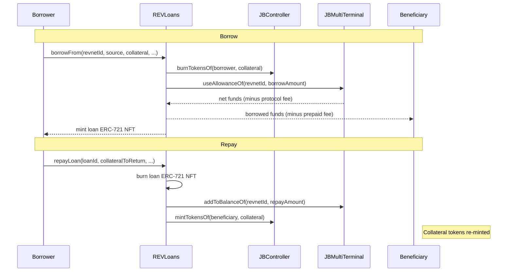

# Revnet Core

Deploy and operate Revnets: unowned Juicebox projects that run autonomously according to predefined stages, with built-in token-collateralized loans.

[Docs](https://docs.juicebox.money) | [Discord](https://discord.gg/nT3XqbzNEr)

## What is a Revnet?

A Revnet is a treasury-backed token that runs itself. No owners, no governors, no multisigs. Once deployed, a revnet follows its predefined stages forever, backed by the Juicebox and Uniswap protocols.

## Conceptual Overview

Revnets are autonomous Juicebox projects with predetermined economic stages. Each stage defines issuance rates, decay schedules, cash-out taxes, reserved splits, and auto-issuance allocations. Once deployed, these parameters cannot be changed -- the revnet operates on its own forever.

### Stage-Based Lifecycle

```
1. Deploy revnet with stage configurations
   → REVDeployer.deployFor(revnetId=0, config, terminals, suckerConfig)
   → Creates Juicebox project owned by REVDeployer (permanently)
   → Deploys ERC-20 token, initializes buyback pools at 1:1 price, deploys suckers
   |
2. Stage 1 begins (startsAtOrAfter or block.timestamp)
   → Tokens issued at initialIssuance rate per unit of base currency
   → Issuance decays by issuanceCutPercent every issuanceCutFrequency
   → splitPercent of new tokens go to reserved splits
   → Cash outs taxed at cashOutTaxRate (2.5% fee to fee revnet)
   |
3. Stage transitions happen automatically
   → When startsAtOrAfter timestamp is reached for next stage
   → New issuance rate, tax rate, splits, etc. take effect
   → No governance, no votes, no owner action required
   |
4. Participants can borrow against their tokens
   → REVLoans.borrowFrom(revnetId, source, collateral, ...)
   → Collateral tokens are burned, funds pulled from treasury
   → Loan is an ERC-721 NFT, liquidates after 10 years
   |
5. Ongoing operations (permissionless or split operator)
   → Auto-issuance claims (permissionless)
   → Buyback pool configuration (split operator)
   → Sucker deployment (split operator, if ruleset allows)
   → Split group updates (split operator)
```

### Token-Collateralized Loans

`REVLoans` lets participants borrow against their revnet tokens. Unlike traditional lending:

- **Collateral is burned, not held.** Tokens are destroyed on borrow and re-minted on repay. This keeps the token supply accurate -- collateral tokens don't exist during the loan. Callers must first grant `BURN_TOKENS` permission to the loans contract via `JBPermissions.setPermissionsFor()`.
- **Borrowable amount = cash-out value.** The bonding curve determines how much you can borrow for a given amount of collateral.
- **Prepaid fee model.** Borrowers choose a prepaid fee (2.5%-50%) that buys an interest-free window. After that window, a time-proportional source fee accrues.
- **Each loan is an ERC-721 NFT.** Loans can be transferred, and expired loans (10 years) can be liquidated by anyone.

#### Loan Flow



### Deployer Variants

Every revnet gets a tiered ERC-721 hook deployed automatically — even if no tiers are configured at launch. This lets the split operator add and sell NFTs later without migration.

- **Basic revnet** -- `deployFor` with stage configurations mapped to Juicebox rulesets and an empty 721 hook. Choose this when the revnet only needs fungible token issuance and the split operator may optionally add NFT tiers later.
- **Tiered 721 revnet** -- `deployFor` adds a tiered 721 pay hook with pre-configured tiers that mint NFTs as people pay. Choose this when the revnet should sell specific NFT tiers from day one, such as membership passes or limited editions.
- **Croptop revnet** -- A tiered 721 revnet with Croptop posting criteria, allowing the public to post content. Choose this when the revnet should function as an open publishing platform where anyone can submit content that gets minted as NFTs according to the configured posting rules.

## Architecture

| Contract | Description |
|----------|-------------|
| `REVDeployer` | Deploys revnets as Juicebox projects owned by the deployer contract itself (no human owner). Translates stage configurations into Juicebox rulesets, manages buyback hooks, tiered 721 hooks, suckers, split operators, auto-issuance, and cash-out fees. Acts as the ruleset data hook and cash-out hook for every revnet it deploys. When 721 tier splits are active, adjusts the payment weight so the terminal only mints tokens proportional to the amount entering the project treasury (the split portion is forwarded separately). |
| `REVLoans` | Lets participants borrow against their revnet tokens. Collateral tokens are burned on borrow and re-minted on repayment. Each loan is an ERC-721 NFT. Charges a prepaid fee (2.5% min, 50% max) that determines the interest-free duration; after that window, a time-proportional source fee accrues. Loans liquidate after 10 years. |

### How They Relate

`REVDeployer` owns every revnet's Juicebox project NFT and holds all administrative permissions. During deployment it grants `REVLoans` the `USE_ALLOWANCE` permission so loans can pull funds from the revnet's terminal. `REVLoans` verifies that a revnet was deployed by its expected `REVDeployer` before issuing any loan.

### Interfaces

| Interface | Description |
|-----------|-------------|
| `IREVDeployer` | Deployment, data hooks, auto-issuance, split operator management, sucker deployment, plus events. |
| `IREVLoans` | Borrow, repay, refinance, liquidate, views, plus events. |

## Install

```bash
npm install @rev-net/core-v6
```

If using Forge directly:

```bash
npm install && forge install
```

If `forge install` has issues, try `git submodule update --init --recursive`.

## Develop

| Command | Description |
|---------|-------------|
| `forge build` | Compile contracts |
| `forge test` | Run tests (20+ test files covering deployment, lifecycle, loans, attacks, invariants) |
| `forge test -vvvv` | Run tests with full traces |

## Repository Layout

```
src/
  REVDeployer.sol                                # Revnet deployer + data hook (~1,287 lines)
  REVLoans.sol                                   # Token-collateralized lending (~1,359 lines)
  interfaces/
    IREVDeployer.sol                             # Deployer interface + events
    IREVLoans.sol                                # Loans interface + events
  structs/
    REVConfig.sol                                # Top-level deployment config
    REVDescription.sol                           # ERC-20 metadata (name, ticker, uri, salt)
    REVStageConfig.sol                           # Economic stage parameters
    REVAutoIssuance.sol                          # Per-stage cross-chain premint
    REVLoan.sol                                  # Loan state
    REVLoanSource.sol                            # Terminal + token pair for loans
    REVBaseline721HookConfig.sol                 # 721 hook config (omits issueTokensForSplits)
    REV721TiersHookFlags.sol                     # 721 hook flags for revnets (no issueTokensForSplits)
    REVDeploy721TiersHookConfig.sol              # 721 hook deployment config wrapper
    REVCroptopAllowedPost.sol                    # Croptop posting criteria
    REVSuckerDeploymentConfig.sol                # Cross-chain sucker deployment
test/
  REV.integrations.t.sol                         # Deployment, payments, cash-outs
  REVLifecycle.t.sol                             # Stage transitions, weight decay
  REVAutoIssuanceFuzz.t.sol                      # Auto-issuance fuzz tests
  REVInvincibility.t.sol                         # Economic property fuzzing
  REVInvincibilityHandler.sol                    # Fuzz handler
  REVDeployerRegressions.t.sol                   # Deployer regressions
  REVLoansSourced.t.sol                          # Multi-source loan tests
  REVLoansUnSourced.t.sol                        # Loan error cases
  REVLoansFeeRecovery.t.sol                      # Fee calculation tests
  REVLoansAttacks.t.sol                          # Flash loan, reentrancy scenarios
  REVLoans.invariants.t.sol                      # Loan fuzzing invariants
  REVLoansRegressions.t.sol                      # Loan regressions
  TestPR09-32_*.t.sol                            # Per-PR regression tests
  helpers/
    MaliciousContracts.sol                       # Attack contract mocks
  mock/
    MockBuybackDataHook.sol                      # Mock for buyback hook tests
script/
  Deploy.s.sol                                   # Sphinx multi-chain deployment
  helpers/
    RevnetCoreDeploymentLib.sol                  # Deployment artifact reader
```

## Permissions

### Split Operator (per-revnet)

The split operator has these default permissions:

| Permission | Purpose |
|------------|---------|
| `SET_SPLIT_GROUPS` | Change reserved token splits |
| `SET_BUYBACK_POOL` | Configure Uniswap buyback pool |
| `SET_BUYBACK_TWAP` | Adjust TWAP window for buyback |
| `SET_PROJECT_URI` | Update project metadata |
| `ADD_PRICE_FEED` | Add price oracle |
| `SUCKER_SAFETY` | Emergency sucker functions |
| `SET_BUYBACK_HOOK` | Swap buyback hook |
| `SET_ROUTER_TERMINAL` | Swap terminal |
| `SET_TOKEN_METADATA` | Update token name and symbol |

Plus optional from 721 hook config: `ADJUST_721_TIERS`, `SET_721_METADATA`, `MINT_721`, `SET_721_DISCOUNT_PERCENT`.

### Global Permissions

| Grantee | Permission | Scope |
|---------|------------|-------|
| `SUCKER_REGISTRY` | `MAP_SUCKER_TOKEN` | All revnets (wildcard projectId=0) |
| `REVLoans` | `USE_ALLOWANCE` | All revnets (wildcard projectId=0) |

### Permissionless Operations

- `autoIssueFor` -- claim auto-issuance tokens (anyone)
- `burnHeldTokensOf` -- burn reserved tokens held by deployer (anyone)

## Risks

- **No human owner.** `REVDeployer` permanently holds the project NFT. There is no function to release it. This is by design -- revnets are ownerless. But it means bugs in stage configurations cannot be fixed after deployment.
- **Loan flash-loan exposure.** `borrowableAmountFrom` reads live surplus, which can be inflated via flash loans. A borrower could temporarily inflate the treasury to borrow more than the sustained value would support.
- **uint112 truncation.** `REVLoan.amount` and `REVLoan.collateral` are `uint112` -- values above ~5.19e33 truncate silently.
- **Cash-out fee stacking.** Cash outs incur both the Juicebox terminal fee (2.5%) and the revnet cash-out fee (2.5% to fee revnet). These compound.
- **Auto-issuance stage IDs.** Stage IDs are `block.timestamp + i` during deployment. These match the Juicebox ruleset IDs because `JBRulesets` assigns IDs the same way (`latestId >= block.timestamp ? latestId + 1 : block.timestamp`), producing identical sequential IDs when all stages are queued in a single `deployFor()` call.
- **NATIVE_TOKEN on non-ETH chains.** Using `JBConstants.NATIVE_TOKEN` on Celo or Polygon means CELO/MATIC, not ETH. Use ERC-20 WETH instead. The matching hash does NOT catch this -- it covers economic parameters but NOT terminal configurations.
- **30-day cash-out delay.** When deploying an existing revnet to a new chain where the first stage has already started, a 30-day delay is imposed before cash outs are allowed, preventing cross-chain liquidity arbitrage.
- **Loan source array growth.** `_loanSourcesOf[revnetId]` is unbounded. If an attacker creates loans from many different terminals/tokens, the array grows without limit.
- **10-year loan liquidation.** Expired loans (10+ years) can be liquidated by anyone. The burned collateral is permanently lost -- it was destroyed at borrow time.
